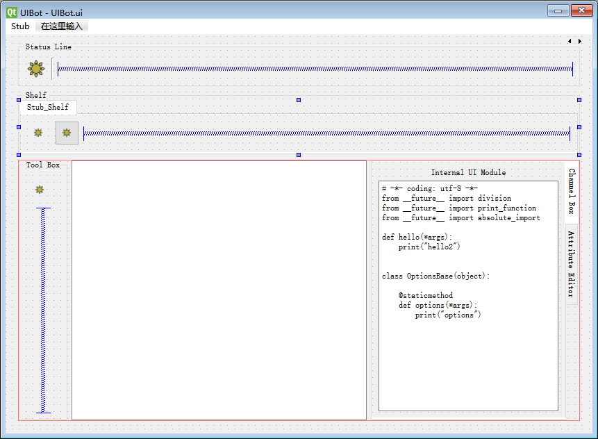
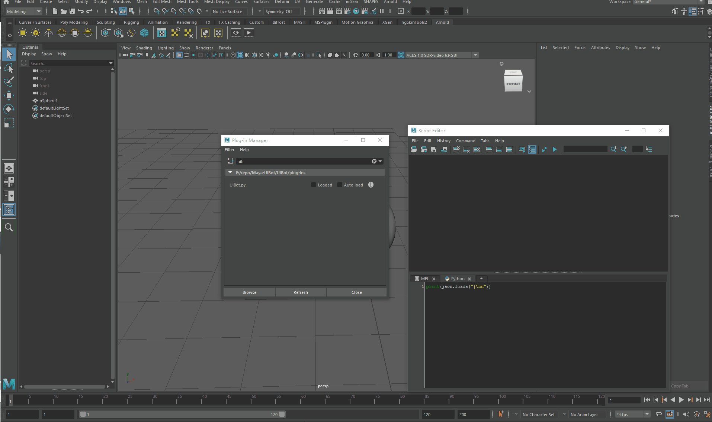

# Maya-UIBot

Autodesk Maya OpenMaya Python Plugin for Adding the MainWindow UI base on a template ui file.

It will much more easy to extend custom menu or iconTextButton in Maya Main Window.

Using Maya Plugin easy to load or unload the ui.

Support `MAYA_UIBOT_PATH` Env for multiple ui integration.

## script flag

direct string -> normal python code or mel code
@`module`:`func_name` -> find the module under the `MAYA_UIBOT_PATH`
module is empty string then reference to the ui PlainTextEdit code

## plugin parser

## TodoList

- [x] Maya Command parse ui to Maya UI (support register & unregister)
- [x] ClassName prefix with `Stub` will ignore
- [ ] ~~optionVar setting for inserting toolbar icon~~
- [ ] Marking Menu Register Support
- [ ] Viewport Tool Setup Support
- [ ] combine multiple ui together order by weight attribute
- [x] -r support partial register
- [x] -d deregister support partial
